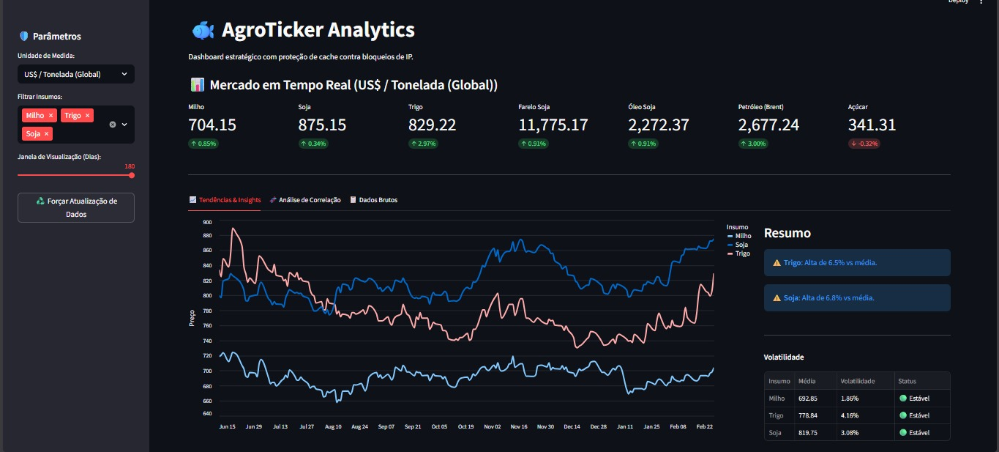
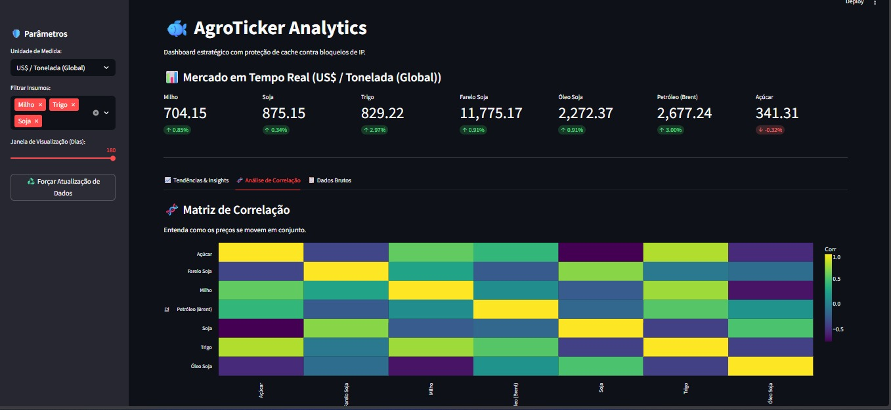
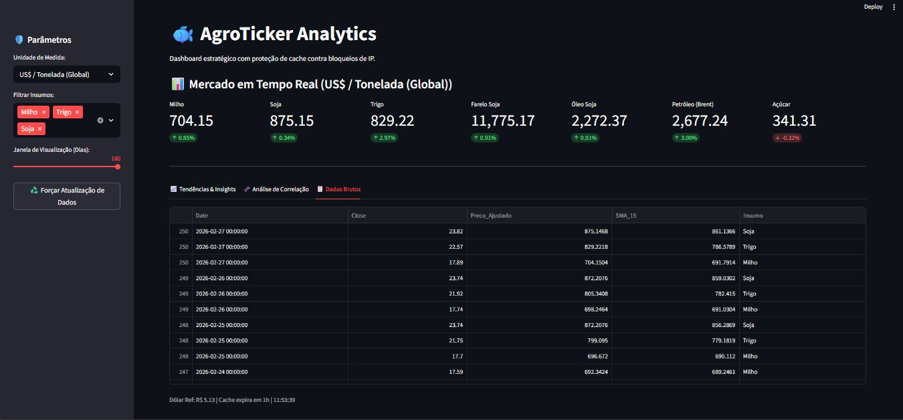

# 🐟 AgroTicker: Monitor de Commodities para Nutrição Aquícola

Sistema inteligente para monitoramento estratégico de insumos, desenvolvido para suporte à decisão na indústria de nutrição animal. O projeto automatiza a coleta, tratamento e visualização de dados de bolsas globais (CBOT/CME), normalizando-os para a realidade do mercado brasileiro.

## 🖥️ Interface do Sistema

Abaixo, apresentamos as principais visualizações do dashboard, demonstrando as análises de tendência, correlação e exploração de dados.

### 📈 Aba 1: Tendências & Insights
Esta visualização foca na evolução histórica dos preços dos insumos selecionados, acompanhada de um resumo executivo com alertas baseados em desvios da média e dados de volatilidade.

### 🧬 Aba 2: Análise de Correlação
Nesta seção, é possível visualizar a matriz de correlação dinâmica. Ela é fundamental para entender como os preços de diferentes componentes se movem em conjunto, auxiliando na gestão de risco de formulação.

### 📋 Aba 3: Dados Brutos
Acesso direto às séries temporais processadas, permitindo a exploração detalhada dos dados numéricos que alimentam as visualizações e análises do sistema.

## 🚀 Funcionalidades Técnicas

* **Data Pipeline Robusto**: Extração automatizada de séries temporais via API `yfinance`.
* **Camada de Cache**: Implementação de `st.cache_data` para otimização de performance e mitigação de bloqueios de IP (Rate Limiting).
* **Normalização Cambial e de Unidades**:
    * Conversão dinâmica USD/BRL em tempo real.
    * Transformação de *US cents/Bushel* para *BRL/Tonelada* utilizando constantes de massa específica (Milho: 25.401kg | Soja: 27.215kg).
* **Analytics & BI**:
    * Matriz de correlação dinâmica para análise de risco e interdependência de insumos.
    * Cálculo de volatilidade industrial e alertas automáticos de desvio de média.
* **Visualização Avançada**: Gráficos interativos com `Altair`, otimizados para evidenciar tendências diárias.

## 🛠️ Stack Tecnológica

* **Linguagem**: Python 3.11+
* **Interface**: Streamlit
* **Data Science**: Pandas (ETL) e Altair (Visualização)
* **Data Source**: Yahoo Finance API

## 📊 Lógica de Negócio (Conversão)

O sistema utiliza a seguinte equação para precificação em moeda local:

$$Preço_{Ton} = \left(\frac{Cotação_{CBOT}}{100}\right) \times Câmbio \times Fator_{Conversão}$$

## 👤 Desenvolvedora

**Thaís Oliveira, Ph.D.** Engenheira de Pesca e Doutora em Aquicultura pela UNESP. Especialista em nutrição animal e coautora de softwares registrados no INPI.

---
*Este projeto demonstra a interseção entre ciência animal e engenharia de dados.*